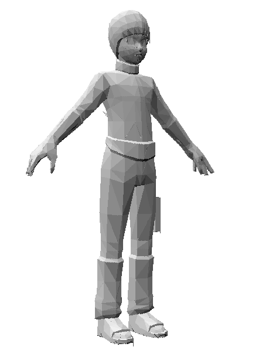

## INFO

Так шо тут у нас. А тут 3д модельки рендерятся.

## Что тут есть?

- Можно загрузить люблю валидную .obj модель!
- Можно использовать и самописыне объекты (cube, thorus, triangle, icosahedron)
- Можно вращать, перемещать, менять размер модели
- Можно менять направление освещения
- Можно анимировать трансформации моделей (прощай фпс)

## Материалы

За основу быа вязта данная статья:
https://habr.com/ru/articles/520090/
Код переписан на JS и местами изменен, хотя математическая модель та же самая.
Имплементированы классы и методы все с нуля т.к. в JS нет Vector3 и т.п.
Все это запихнул в канвас

## todo

- Добавить отраженный свет в Шейдеры ( + вынести все в один класс)
- добавить текстуры
- починить z-buf и убрать возникающие полоски

